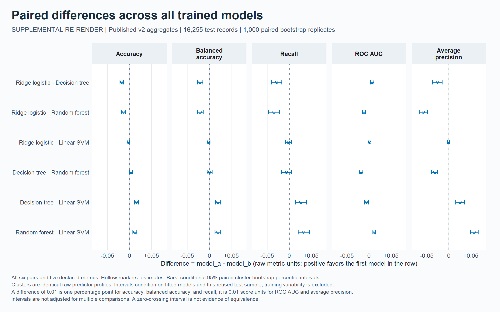

# Income Level Prediction Using R

A reproducible R comparison of a majority baseline, ridge logistic regression, a decision tree, a probability random forest, and a linear SVM on the [UCI Adult dataset](https://archive.ics.uci.edu/dataset/2/adult).

Esad Kopru built the original project as an independent learning exercise. Version 2 revises its evaluation and adds grouped cross-validation, probability diagnostics, conditional uncertainty, and traceable outputs. The [original script](archive/IncomeLevelPrediction_original.R) and [complete version 1 snapshot](archive/v1-2026-10-08/README.md) remain preserved.

**Scope:** a historical, unweighted classification study. The official test file was already examined in version 1, so version 2 uses a **reused benchmark test**, not a fresh independent confirmation. This is not a current-income estimator or deployed decision system.

## Run the project

Use **R 4.6.1**. The checked-in `renv.lock` records 34 package versions, including `glmnet`, `ranger`, `rpart`, `e1071`, and `ggplot2`. From the repository directory:

```sh
Rscript --vanilla scripts/install_dependencies.R
Rscript --vanilla tests/run_tests.R
Rscript --vanilla scripts/verify_evidence.R
Rscript --vanilla IncomeLevelPrediction.R --download --smoke --output results/v2-smoke
Rscript --vanilla IncomeLevelPrediction.R --download --output results/v2-full
```

The installer restores recorded packages into the ignored project-local `.R-library` as needed. It requires internet access. The workflow verifies all locked package versions before fitting. `--vanilla` prevents restored workspaces and startup profiles from affecting execution.

Downloading is explicit. `--download` fetches `adult.data`, `adult.test`, and `adult.names` into `data/raw` and checks their recorded UCI hashes. Existing files supplied with that flag must also match. With local data:

```sh
Rscript --vanilla IncomeLevelPrediction.R --data-dir data/raw --output results/v2-local
```

Compatible custom inputs can run without `--download`; their reports and figures are marked as custom when their hashes differ. They cannot be exported as official-reference portfolio evidence.

| Option | Default and purpose |
| --- | --- |
| `--seed` | `12345`; deterministic random operations |
| `--trees` | `500`; probability-forest trees |
| `--folds` | `5`; grouped training cross-validation folds |
| `--bootstrap` | `1000`; paired raw-signature cluster-bootstrap replicates |
| `--smoke` | Sampled execution check with reduced computation |
| `--help` | Full command usage |

A smoke run uses at most 1,200 training and 600 test rows, 30 trees, three folds, 40 bootstrap replicates, and the first candidate per family. Its scores are not full-study evidence.

Default paths are project-local. Without `--output`, the output is `results/v2-YYYYMMDD-HHMMSS` using UTC. Explicit relative paths resolve from the invocation directory. Nonempty output directories are refused; use a new directory for each run. Creation and write access are checked before downloading or training.

Each new run's `methodology.md` compares effective settings with the historical reference plan and records smoke sampling or custom inputs. Overrides define a separate configuration. Matching the four numeric defaults alone does not establish that source code, inputs, or environment match the published experiment.

## Evaluation design

The detailed [version 2 protocol](docs/METHODOLOGY_V2.md) was written before the version 2 full run, after version 1 results had been inspected. It records the search grids, metric definitions, uncertainty assumptions, and interpretation limits.

- Preserve the official training/test boundary. Remove only identical full training records, retaining two conflicting-label rows for one raw predictor signature. This leaves 32,537 training records.
- Exclude test records matching any original training signature across all 14 raw predictor fields, without consulting test labels. Retain 16,255 test records and their remaining repeated signatures. Signatures are not person identifiers.
- Use five training folds grouped by those raw signatures, approximately balancing class counts. Fit imputation, category encoding, and scaling inside each analysis fold. Select settings by mean validation-fold balanced accuracy, then refit on all eligible training records.
- Apply fixed `log1p` transformations to capital gain and loss. Keep numeric education; exclude text education and `fnlwgt`. All models receive the same encoded predictor matrix. Report unweighted sample metrics.
- Keep classification thresholds fixed: probability `> 0.5` or oriented SVM margin `> 0` predicts `>50K`; ties predict `<=50K`. Version 2 test labels do not select settings or thresholds.

| Model | Implementation and selection |
| --- | --- |
| Majority baseline | Constant training prevalence |
| Ridge logistic regression | `glmnet`, positive ridge penalty, training-only standardization |
| Decision tree | `rpart`, complexity chosen by grouped cross-validation |
| Probability random forest | `ranger`, 500 trees, one thread, feature-subsampling rule selected by cross-validation |
| Linear SVM | `e1071`, selected cost, oriented uncalibrated decision margins |

Numerical nonconvergence or nonfinite ridge coefficients stop the run. The forest operates on encoded columns rather than native categorical fields.

## What is measured

Accuracy, balanced accuracy, precision, recall, specificity, F1, confusion counts, ROC AUC, and average precision describe different aspects of classification and ranking. Average precision uses stepwise recall increments at tied-score thresholds; it is not trapezoidal PR area. Undefined metrics remain `NA`.

Probability-producing models also receive Brier scores, log loss, and ten-bin calibration summaries. SVM margins receive no probability metrics or calibration curve. Calibration plots are descriptive and do not fit a correction.

The default 1,000 paired bootstrap replicates resample clusters defined by all 14 raw predictor fields. Every model uses the same sampled clusters. Reported 95% percentile intervals and all six pairs of trained-model differences are **conditional on the fitted models and this reused test sample**. They exclude training and selection variability, prior test exposure, population shift, and unknown person-level dependence. They are not multiplicity-adjusted significance tests.

Recorded sex and race remain predictors. Subgroup tables include denominators and descriptive Wilson intervals. Separate matched-profile and novel-profile summaries use the 12 modeled raw fields without dropping either group. These checks do not certify fairness, establish causal discrimination, or identify repeated people.

## Version 2 results and conclusion

The full run completed on October 8, 2026 with 32,537 training and 16,255 reused-test records, seed `12345`, five folds, 500 forest trees, and 1,000 bootstrap replicates. The [results report](docs/evidence/v2-full-2026-10-08/report.md) and [exact metrics](docs/evidence/v2-full-2026-10-08/metrics.csv) are exported separately from version 1.

Training cross-validation preferred the probability random forest: mean balanced accuracy was 78.32%, compared with 78.23% for the tree. Selected settings were ridge `lambda = 0.0001`, tree `cp = 0.0005`, forest `mtry = floor(p / 3)` (28 columns in the final fit), and SVM `cost = 10`.

| Model | Accuracy | Balanced accuracy | ROC AUC | Average precision |
| --- | ---: | ---: | ---: | ---: |
| Majority baseline | 76.38% | 50.00% | 0.5000 | 0.2362 |
| Ridge logistic regression | 84.66% | 75.79% | 0.8980 | 0.7354 |
| Decision tree | 86.42% | 77.92% | 0.8910 | 0.7615 |
| Probability random forest | 86.04% | 77.88% | 0.9090 | 0.7933 |
| Linear SVM | 84.80% | 75.94% | 0.8968 | 0.7357 |

The tree had the highest observed test accuracy and balanced accuracy. The CV-preferred forest had the highest ROC AUC and average precision, and the lowest Brier score (0.0971) and log loss (0.3137). The tree-minus-forest balanced-accuracy difference was only 0.043 percentage points, with a conditional 95% paired interval of -0.523 to 0.626 points. That interval includes zero; it does not establish a clear balanced-accuracy advantage.

At its fixed threshold, the forest missed 1,443 of 3,840 positive records and produced 827 false positives. Its recall was 62.42%. Strong ranking therefore did not eliminate classification errors. For log-loss calculation, 2,156 forest probabilities required clipping at the declared numerical bounds; lower aggregate probability error does not establish perfect calibration.

**Conclusion:** the reproducible comparison exposes tradeoffs among classification, ranking, probability quality, and subgroup errors. It supports the declared CV selection while preserving observed test differences and uncertainty. It does not establish a universal winner or independent confirmation on a fresh population.

The published run records 75 successful fits and no model warnings; its 18-check regression suite passed before publication. Independent auditing reproduced the saved prediction metrics and selection results, verified the manifests, and checked restored-model scoring. All six PNGs and all six rendered PDFs passed visual inspection. The [validation record](docs/VALIDATION.md) separates that historical validation from subsequent maintenance checks.

## Evidence and figures

Each run saves the selected settings, fold scores, model diagnostics, evaluation tables, plots, input/source manifests, package versions, and a written results-and-conclusion report.

The verified version 2 run contains 40 local files. Its aggregate export contains 35 files, including its public manifest; row-level predictions, fold identifiers, model objects, and session details are excluded.

| Evidence | Main files |
| --- | --- |
| Results and selected settings | `report.md`, `metrics.csv`, `selected_parameters.csv` |
| Grouped model selection | `cv_metrics.csv`, `cv_summary.csv`, `diagnostics.csv` |
| Conditional uncertainty | `metric_intervals.csv`, `paired_differences.csv`, `bootstrap_design.csv` |
| Probability and subgroup checks | `calibration.csv`, `subgroup_metrics.csv` |
| Profile sensitivity | `profile_overlap.csv`, `profile_sensitivity.csv` |
| Data and provenance | `data_audit.csv`, `input_manifest.csv`, `source_manifest.csv`, `package_versions.csv`, `run_config.txt`, `methodology.md` |
| Local-only detail | `predictions.csv`, `oof_predictions.csv`, `fold_assignments.csv`, `split_assignments.csv`, `models.rds`, `session_info.txt` |

Six `ggplot2` figures are exported as **2400 x 1500 PNGs** and matching **12 x 7.5 inch vector PDFs**:

| File stem | Contents |
| --- | --- |
| `model_comparison` | Four metrics and conditional bootstrap intervals |
| `roc_pr_curves` | ROC and precision-recall curves |
| `confusion_matrices` | Class counts and within-class percentages |
| `calibration` | Probability reliability, bin sizes, and descriptive intervals |
| `cv_comparison` | Training-fold variability for selected settings |
| `subgroup_recall` | Recall by recorded sex and race with denominators and intervals |

The workflow snapshots nine source, protocol, and lockfile hashes plus input hashes before fitting, then verifies them again before finalizing. Changed files prevent successful finalization. Run and public manifests record output hashes and byte sizes.

The [preserved version 2 source](archive/v2-2026-10-08/README.md) matches the published run's nine source hashes. Current maintenance code has different hashes. `scripts/verify_evidence.R` checks committed evidence and archived provenance on both CI platforms without downloading records or fitting models. For the complete original checkout, use publication commit `2ab72d12cf5290df1841da70b524740a70718c17` in a separate checkout.

The [supplemental uncertainty figures](docs/figures/v2-uncertainty-review/README.md) redraw the same saved estimates and intervals with clearer markers and all paired comparisons. They do not replace the original figures or report a new experiment.



## Export aggregate evidence

After completing and inspecting a full run:

```sh
Rscript --vanilla scripts/export_evidence.R results/v2-full results/v2-full-public
```

Use the actual run directory and a new destination; the example matches the full-run command above and keeps the review copy in ignored `results/`. The exporter verifies artifact integrity, complete version 2 status, official input checksums, and successful model diagnostics. It copies a fixed allowlist of aggregate outputs and checks the copied files. Read the run-specific methodology before interpreting an export with modified settings. Record-level predictions, fold identifiers, fitted models, and session details stay local.

The default `data/raw/`, `results/`, and `.R-library/` directories are ignored by Git. Custom output directories require separate publication review. A checksum match establishes file integrity, not scientific validity or privacy review.

## Project history and layout

The original script mixed cleaned and uncleaned row indices, trained some models on evaluation records, applied a probability-style threshold to log odds, and used class labels in a ROC calculation. The [code review](docs/CODE_REVIEW.md) records those findings.

Version 1 corrected that workflow. Version 2 changes training retention, selection, transformations, logistic regularization, and the forest implementation. Score differences cannot be attributed to one change without a controlled comparison. Historical screenshots remain evidence of the original learning exercise.

```text
IncomeLevelPrediction.R          Command-line entry point
R/                              Data, models, evaluation, plots, reporting
renv.lock                       R and package version record
scripts/                        Restore, export, verification, supplemental plots
tests/                          Offline regression checks
data/README.md                  Source and processing policy
docs/METHODOLOGY_V2.md           Declared version 2 protocol
docs/VALIDATION.md               Observed checks and limits
docs/PORTFOLIO_HANDOFF.md        Copy and image specifications
archive/                        Original script, v1 snapshot, published v2 source
```

The revised project is maintained in the public repository [efkopru/income-level-prediction](https://github.com/efkopru/income-level-prediction). Hosted Windows/Linux check results are available in [GitHub Actions](https://github.com/efkopru/income-level-prediction/actions/workflows/check.yml).

The [existing portfolio page](https://www.ekopru.com/income-level-prediction-using-r/index.html) still links to the historical [efkopru/ILPrediction](https://github.com/efkopru/ILPrediction). The live portfolio has not been changed; the [portfolio handoff](docs/PORTFOLIO_HANDOFF.md) contains the revised copy and assets.

## Attribution and code rights

Becker, B. and Kohavi, R. (1996). *Adult*. UCI Machine Learning Repository. [doi:10.24432/C5XW20](https://doi.org/10.24432/C5XW20). Data license: [CC BY 4.0](https://creativecommons.org/licenses/by/4.0/).

The historical labels, sampling, income threshold, and category definitions limit transfer to current populations. No code license has been selected; the data license does not license this project's code.

