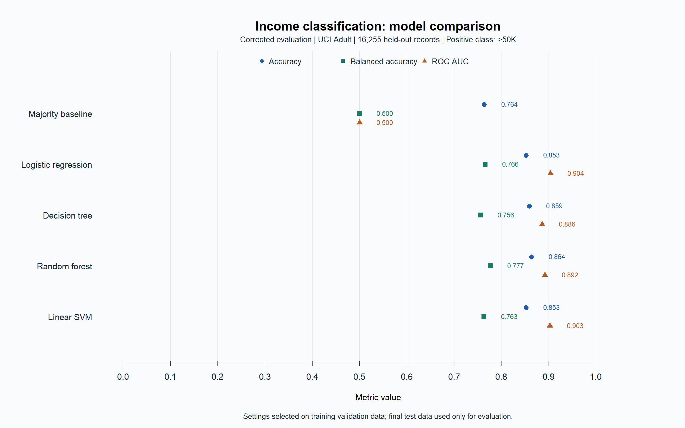
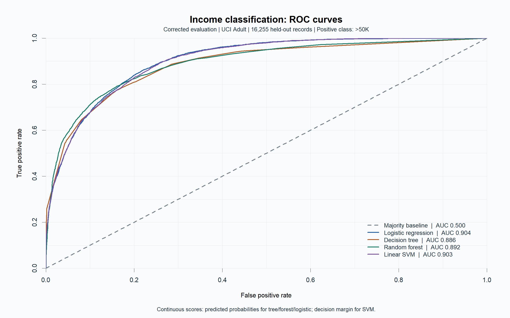

# Income classification: verified local run

Full-data evaluation of the revised R implementation, separate from the historical presentation.

Data provenance: adult.data and adult.test match the recorded UCI checksums.
Training rows: 32535. Test rows: 16255. Seed: 12345. Forest trees: 200.

Settings were selected by balanced accuracy on a stratified validation subset of training data,
then each selected model was fitted again on all eligible training rows. The test set did not tune models.

| Model | Accuracy | Balanced accuracy | Precision (>50K) | Recall (>50K) | ROC AUC |
|---|---:|---:|---:|---:|---:|
| majority | 0.7638 | 0.5000 | NA | 0.0000 | 0.5000 |
| logistic | 0.8527 | 0.7657 | 0.7282 | 0.6008 | 0.9040 |
| tree | 0.8589 | 0.7563 | 0.7795 | 0.5617 | 0.8862 |
| forest | 0.8640 | 0.7769 | 0.7656 | 0.6117 | 0.8922 |
| svm | 0.8527 | 0.7634 | 0.7320 | 0.5940 | 0.9027 |

## Interpretation and limits

The majority baseline makes class imbalance visible. All classification thresholds are fixed in advance:
probability >0.5, or an oriented SVM margin >0; exact ties predict <=50K.
The SVM score is not a calibrated probability. ROC AUC uses continuous scores and gives half credit to ties.
Raw training duplicates and conflicting-label signatures are excluded, and test records matching original
training predictors are excluded. Test-internal duplicate counts remain in the evaluation; see data_audit.csv.
No person identifiers are available to establish complete entity independence.

This is an unweighted historical 1994 Census learning benchmark. It is not a current income estimator,
causal analysis, fairness certification, or production decision system. Sex and race are included predictors;
subgroup_metrics.csv gives descriptive sample sizes and errors, with NA for undefined metrics.
A single validation split and small search grids do not establish statistical superiority or broad optimality.
Historical slide numbers are not directly comparable because partitions and preprocessing changed.

## Run warnings

- glm.fit: fitted probabilities numerically 0 or 1 occurred

## Evidence

See metrics.csv, validation_metrics.csv, selected_parameters.csv, data_audit.csv,
split_assignments.csv, predictions.csv, input_manifest.csv, source_manifest.csv, package_versions.csv,
run_config.txt, session_info.txt, unseen_categories.csv, and artifact_manifest.csv.

Source: [UCI Adult](https://archive.ics.uci.edu/dataset/2/adult).
Becker, B. and Kohavi, R. (1996). Adult. DOI: 10.24432/C5XW20. Dataset license: CC BY 4.0.
