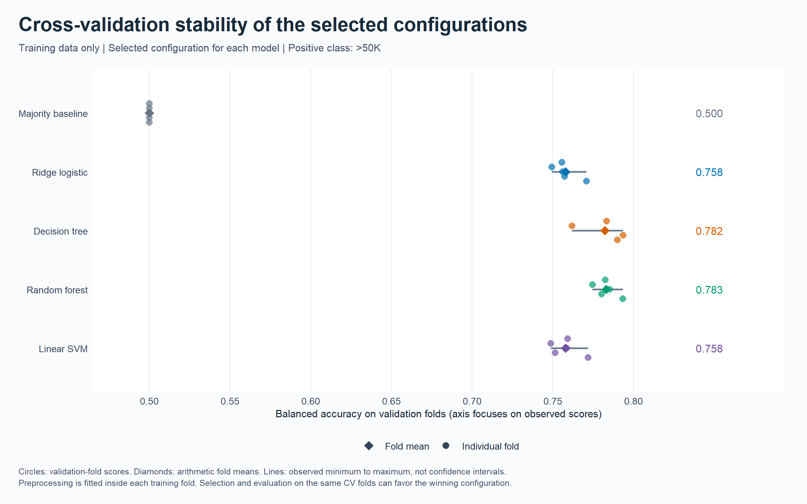
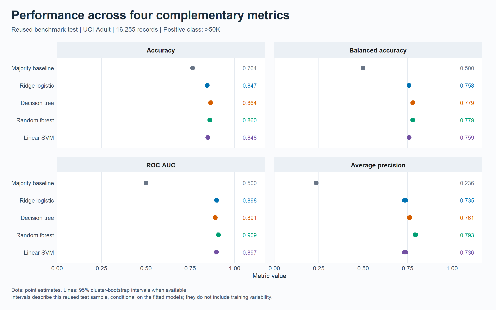
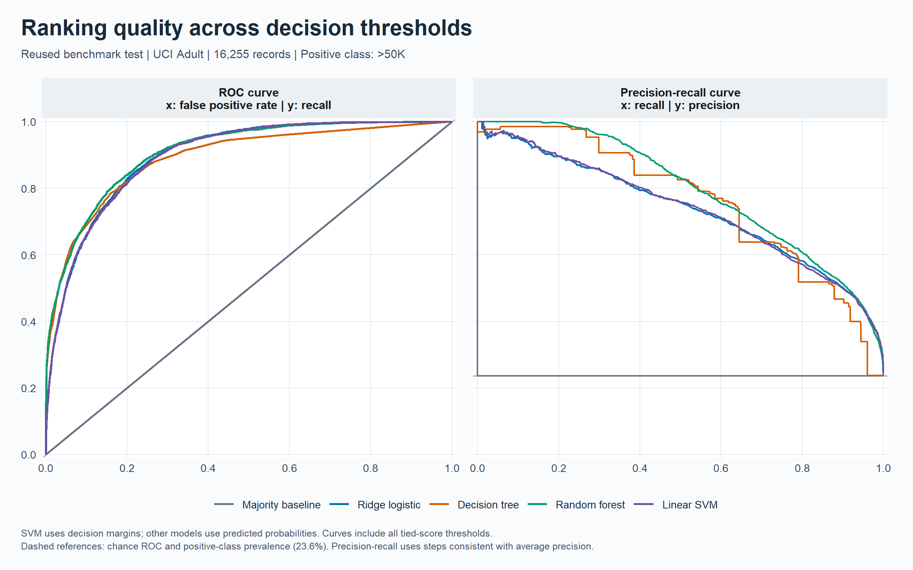
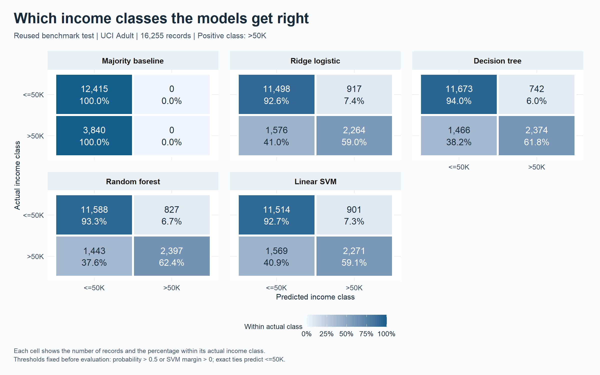
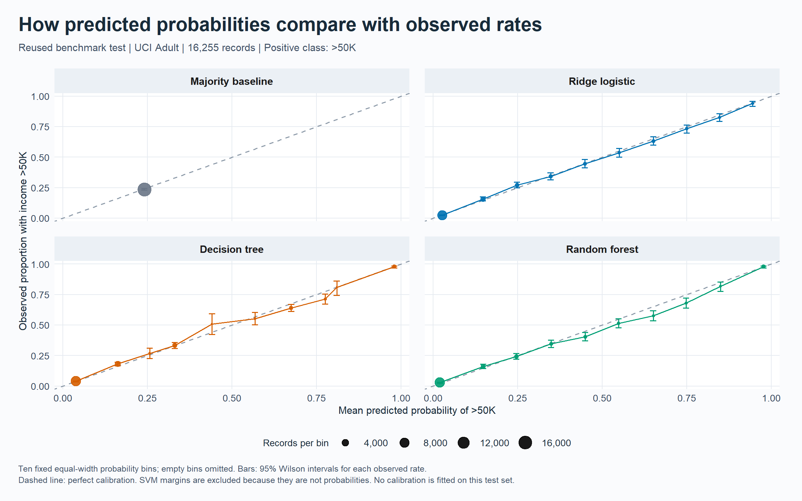
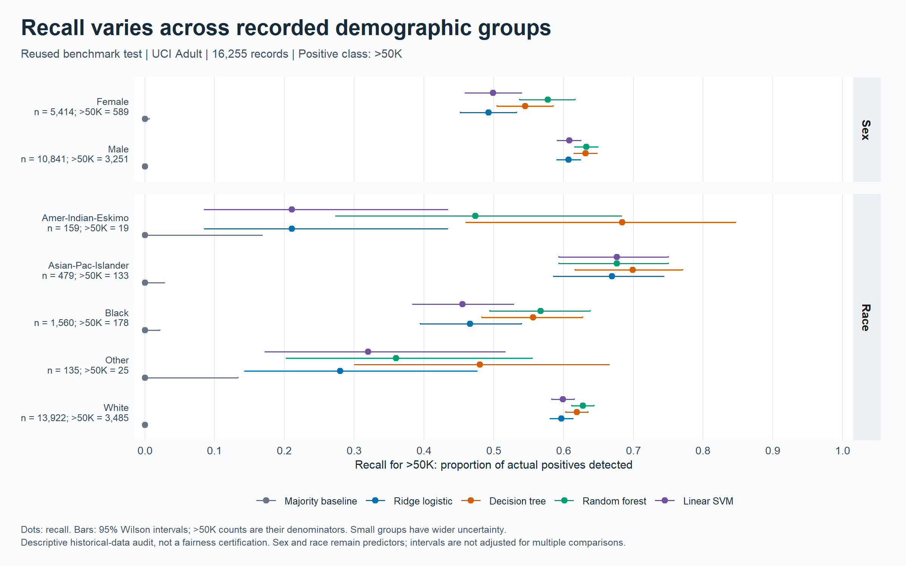

# Income Level Prediction Using R: results and conclusion

**Version 2.** A revised analysis with grouped training cross-validation, probability diagnostics, and uncertainty intervals.

## Study question and scope

How do a majority baseline, ridge logistic regression, a decision tree, a probability random forest,
and a linear SVM compare when predicting the historical UCI Adult income category >50K?
This evaluates classification, ranking, and probability quality as separate properties.

The official benchmark test was examined in version 1. It is a **reused benchmark test**, not a fresh
independent validation sample. The version 2 protocol was written before this run; test results did not
select its model settings or thresholds. The previous code and evidence remain preserved separately.

## Data and methods

Input status: both files match the recorded UCI reference checksums.
Final training sample: 32537 records. Reused test sample: 16255 records. Test positive prevalence: 23.62%.
Exact repeated training records are collapsed. Predictor profiles with conflicting training labels remain
in the sample and in the same CV fold. Test rows matching original training raw predictor signatures are
excluded under the predeclared policy. Internal test repetitions remain; uncertainty resamples their clusters.

Model selection used 5 approximately class-stratified folds grouped by all 14 raw predictor fields.
Imputation, categorical encoding, and scaling were learned inside each analysis fold. Capital gain and loss
received a fixed log1p transformation. Redundant text education and fnlwgt were excluded; sample weights were not used.
The primary selection metric was mean fold balanced accuracy, with declaration order breaking ties.
Thresholds remained probability >0.5 and oriented SVM margin >0. No test-based threshold tuning occurred.
Selected settings were refitted on all eligible training records. Ridge logistic regression uses glmnet;
the forest uses ranger leaf probabilities on the common encoded feature matrix. SVM scores are margins.

Full specifications and cited sources are in [the recorded methodology](methodology.md).

## Cross-validation and selected settings

| Model | Selected setting | Mean balanced accuracy | Fold SD |
|---|---|---:|---:|
| Majority baseline | prevalence | 0.5000 | 0.0000 |
| Ridge logistic regression | lambda=1e-04 | 0.7579 | 0.0079 |
| Decision tree | cp=5e-04 | 0.7823 | 0.0123 |
| Probability random forest | mtry=third | 0.7832 | 0.0070 |
| Linear SVM | cost=10 | 0.7580 | 0.0090 |

The training-CV selection rule preferred **Probability random forest** before evaluating the reused test set.
Fold SD describes variation among dependent folds; it is not a confidence interval. CV scores used for
selection are optimistic as performance estimates. They should not be presented as external validation.

## Reused-test results

| Model | Accuracy | Balanced accuracy | Precision >50K | Recall >50K | ROC AUC | Average precision |
|---|---:|---:|---:|---:|---:|---:|
| Majority baseline | 76.38% | 50.00% | NA% | 0.00% | 0.5000 | 0.2362 |
| Ridge logistic regression | 84.66% | 75.79% | 71.17% | 58.96% | 0.8980 | 0.7354 |
| Decision tree | 86.42% | 77.92% | 76.19% | 61.82% | 0.8910 | 0.7615 |
| Probability random forest | 86.04% | 77.88% | 74.35% | 62.42% | 0.9090 | 0.7933 |
| Linear SVM | 84.80% | 75.94% | 71.60% | 59.14% | 0.8968 | 0.7357 |

The CV-preferred model achieved 86.04% accuracy, 77.88% balanced accuracy, and 62.42% recall for >50K.
Its balanced-accuracy interval was 0.771 to 0.787; its ROC-AUC interval was 0.904 to 0.914.
The majority baseline accuracy was 76.38% and its balanced accuracy was 50%.
Average precision uses tied-score threshold groups and non-interpolated recall increments; it is not
trapezoidal PR area. Its constant-score baseline equals positive prevalence.

## Uncertainty and model comparisons

The run used 1000 paired cluster-bootstrap replicates with 95% percentile intervals.
A cluster is one raw 14-predictor signature; every model uses the same sampled clusters. Intervals condition
on these already-fitted models and this benchmark sample. They do not include training, model-selection,
population-shift, or prior test-exposure uncertainty. Clusters are not verified person identifiers.
[Paired differences](paired_differences.csv) cover all six pairs of trained models. Positive values favor
model_a for the listed metric. These unadjusted exploratory intervals are not multiplicity-corrected tests
and do not establish a universal winning method.

## Probability quality

| Probability model | Brier score (lower is better) | Log loss (lower is better) | Probabilities clipped for log loss |
|---|---:|---:|---:|
| Majority baseline | 0.1805 | 0.5468 | 0 |
| Ridge logistic regression | 0.1060 | 0.3307 | 0 |
| Decision tree | 0.0995 | 0.3297 | 127 |
| Probability random forest | 0.0971 | 0.3137 | 2156 |

Log loss clips probabilities at 1e-15 and 1-1e-15. Calibration plots use ten fixed equal-width bins,
show bin sizes and descriptive Wilson intervals, and do not recalibrate models. Uncalibrated SVM margins
are excluded from Brier score, log loss, and calibration plots.

## Subgroup and profile checks

Recorded sex and race remain predictors. Subgroup results show denominators and descriptive error-rate
intervals. Different group distributions, small samples, historical categories, and unknown entities limit
interpretation. These comparisons neither identify causal discrimination nor establish fairness.

2953 test records share the 12 modeled raw predictor values with training; 13302 have a novel profile.
These coarse demographic matches do not establish repeated-person leakage. The [profile sensitivity table](profile_sensitivity.csv)
reports the two subsets without changing the primary evaluation or selecting models from those results.

## Conclusion

The revised training procedure selected Probability random forest using grouped cross-validation.
On the reused benchmark, Decision tree had the highest observed accuracy, Probability random forest the highest ROC AUC, and Probability random forest the highest average precision.
At its fixed classification threshold, the CV-preferred model missed 1443 of 3840 >50K records and generated 827 false positives.
This separates useful ranking from the practical errors made at a chosen threshold. Probability calibration
and subgroup performance add information that accuracy alone cannot supply. The uncertainty estimates
quantify conditional test-sample variability while preserving the limits of this reused benchmark.

The defensible contribution is a reproducible R comparison with explicit data handling, grouped model selection,
traceable outputs, and multidimensional evaluation. It is not a current-income estimator, a causal study,
a deployment validation, or evidence of universal model superiority. A fresh external or temporal sample
would be required for a stronger generalization claim. Version 1 and historical slide scores are separate experiments.

## Diagnostics and provenance

No model warnings were recorded.
Fitting failures abort the run. [Model diagnostics](diagnostics.csv), [input hashes](input_manifest.csv),
[source and protocol hashes](source_manifest.csv), [package versions](package_versions.csv), and run_config.txt
record the completed run. Public exports contain aggregate evidence; record-level predictions, fold IDs,
and fitted objects remain local. The renv lockfile records package versions for restoration.

Data: Becker, B. and Kohavi, R. (1996). [Adult, UCI](https://archive.ics.uci.edu/dataset/2/adult).
DOI: 10.24432/C5XW20. Dataset license: CC BY 4.0.
